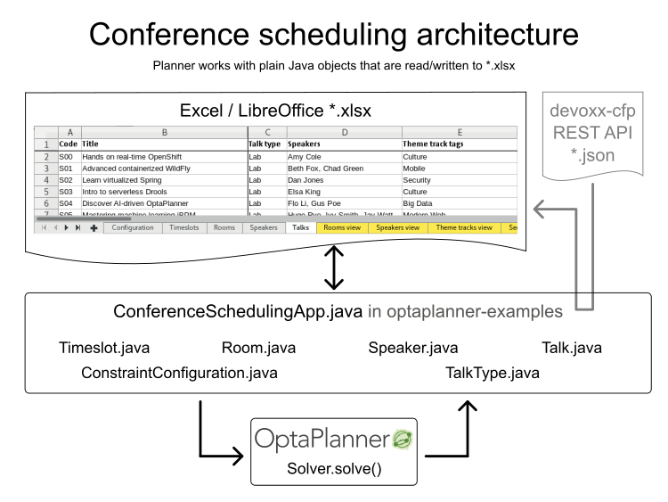

= Conference scheduling
:jbake-type: useCaseBase
:jbake-description: Use OptaPlanner (Java™, open source) to optimize assigning conference talks to timeslots and rooms.
:jbake-priority: 1.0
:jbake-related_tag: conference scheduling
:jbake-featured_youtube_id: ykF8DjxhQJI

Conference scheduling assigns each talk to a timeslot and a room.
Our implementation scheduled talks for major IT events, such as Devoxx, Red Hat Summit and Voxxed.

image:conferenceSchedulingValueProposition.png[Conference scheduling value proposition]

== What is OptaPlanner's ConferenceSchedulingApp?

The `ConferenceSchedulingApp` assigns conference talks to timeslots and rooms,
while adhering to 30+ constraints, such as speaker availability, content conflicts, language diversity and many more.
It can read the list of speakers, rooms, timeslots and talks from an Excel file
or from the devoxx-cfp REST API. Internally, it uses plain old Java™ domain objects:

`ConferenceSchedulingApp` is open source (Apache License) software,
because it's part of `optaplanner-examples`.
To try it, click the green button to download it and then run the examples.

== What is OptaPlanner?

OptaPlanner is the leading Open Source Java™ AI constraint solver
to optimize conference schedules.

OptaPlanner is *a lightweight, embeddable planning engine*.
It enables everyday Java™ programmers to solve optimization problems efficiently.
It is also compatible with other JVM languages (such as Kotlin and Scala).
Constraints apply on plain domain objects and can call existing code.
There's no need to input constraints as mathematical equations.
Under the hood, OptaPlanner combines sophisticated Artificial Intelligence optimization algorithms
(such as Tabu Search, Simulated Annealing, Late Acceptance and other metaheuristics)
with very efficient score calculation and other state-of-the-art constraint solving techniques.

OptaPlanner is *open source software*, released under link:../../code/license.html[the Apache License].
It is written in 100% pure Java™, runs on any JVM and is available in link:../../download/download.html[the Maven Central repository] too.
