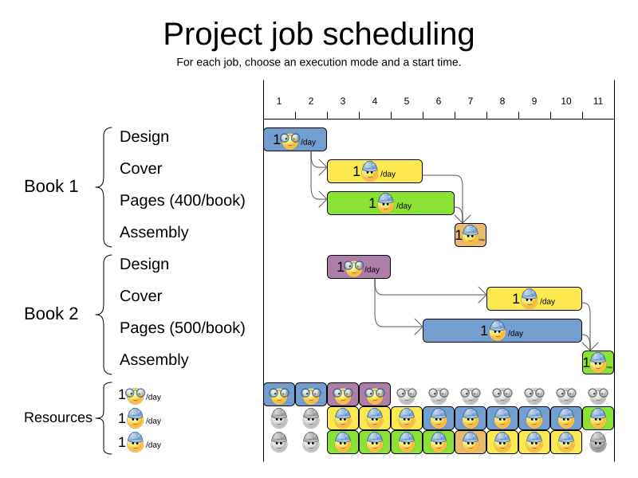

= Job shop scheduling
:jbake-type: useCaseBase
:jbake-description: Use OptaPlanner (Java™, open source) to optimize assigning jobs to machines or assembly lines.
:jbake-priority: 1.0
:jbake-related_tag: job shop scheduling
:jbake-featured_youtube_id: _2zweB9JD7c

Order and assign jobs to machines or assembly lines to reduce the makespan of projects
and increase throughput.

// TODO Job Shop scheduling value proposition image

== What is OptaPlanner?

OptaPlanner is the leading Open Source Java™ AI constraint solver
to optimize assigning tasks to employees,
adhering to skill, affinity and other constraints.

OptaPlanner is *a lightweight, embeddable planning engine*.
It enables everyday Java™ programmers to solve optimization problems efficiently.
It is also compatible with other JVM languages (such as Kotlin and Scala).
Constraints apply on plain domain objects and can call existing code.
There's no need to input constraints as mathematical equations.
Under the hood, OptaPlanner combines sophisticated Artificial Intelligence optimization algorithms
(such as Tabu Search, Simulated Annealing, Late Acceptance and other metaheuristics)
with very efficient score calculation and other state-of-the-art constraint solving techniques.

OptaPlanner is *open source software*, released under link:../../code/license.html[the Apache License].
It is written in 100% pure Java™, runs on any JVM and is available in link:../../download/download.html[the Maven Central repository] too.
