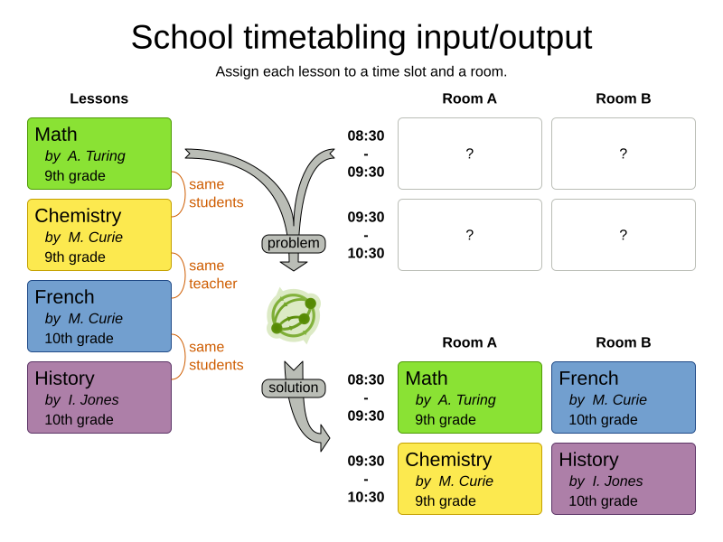

= School timetabling
:jbake-type: useCaseBase
:jbake-description: Use OptaPlanner (Java™, open source) to optimize school timetabling, adhering to teacher availability, room capacity and other constraints.
:jbake-priority: 1.0
:jbake-related_tag: school timetabling
:jbake-featured_youtube_id: HO7l3rWb_uo
:jbake-featured_quickstart_guide_url: https://www.optaplanner.org/docs/optaplanner/latest/quickstart/overview/overview-quickstarts.html
:jbake-featured_quickstart_github_url: https://github.com/kiegroup/optaplanner-quickstarts/tree/stable/use-cases/school-timetabling#readme

Universities and schools aim to provide high quality lesson schedules
to their teachers and students.
Depending on room capacity and availability,
_school timetabling_ decides when and where a lecture takes place.
Optimize this planning problem with an AI constraint solver to improve
teacher and student satisfaction.
Reduce commute and gap hours while adhering to other constraints such as
conflicting lessons, teacher availability, room availability and room capacity.

// TODO School timetabling value proposition image

== What is OptaPlanner?

OptaPlanner is the leading Open Source Java™ AI constraint solver
to optimize maintenance scheduling,
adhering to skill, capacity, SLAs and other constraints.

OptaPlanner is *a lightweight, embeddable planning engine*.
It enables normal Java™ programmers to solve optimization problems efficiently.
It is also compatible with other JVM languages (such as Kotlin and Scala).
Constraints apply on plain domain objects and can call existing code.
There's no need to input constraints as mathematical equations.
Under the hood, OptaPlanner combines sophisticated Artificial Intelligence optimization algorithms
(such as Tabu Search, Simulated Annealing, Late Acceptance and other metaheuristics)
with very efficient score calculation and other state-of-the-art constraint solving techniques.

OptaPlanner is *open source software*, released under link:../../code/license.html[the Apache License].
It is written in 100% pure Java™, runs on any JVM and is available in link:../../download/download.html[the Maven Central repository] too.
