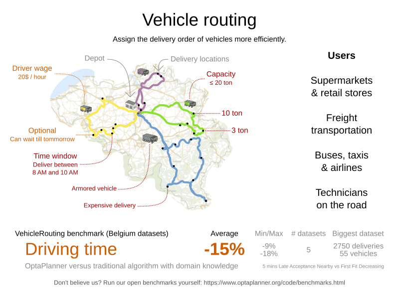

= Vehicle Routing Problem
:jbake-type: useCaseBase
:jbake-description: OptaPlanner is an Open Source Java™ engine to optimize Vehicle Routing Problem and Traveling Salesman Problem variants.
:jbake-priority: 1.0
:jbake-related_tag: vehicle routing
:jbake-featured_youtube_id: 3Bgt4xC4a1M
:jbake-featured_quickstart_github_url: https://github.com/kiegroup/optaweb-vehicle-routing#readme

The Vehicle Routing Problem (VRP) optimizes the routes of delivery trucks,
cargo lorries, public transportation (buses, taxis and airplanes)
or technicians on the road, by improving the order of the visits.
This routing optimization heavily reduces driving time and fuel consumption compared to manual planning:

OptaPlanner is flexible enough to handle any VRP variant.
It includes examples of CVRP (Capacitated Vehicle Routing Problem)
and VRPTW (Vehicle Routing Problem with Time Windows).

**https://github.com/kiegroup/optaweb-vehicle-routing[Fork our Vehicle Routing application]
and customize that template to your needs.**

== What is OptaPlanner?

OptaPlanner is the leading Open Source Java™ AI constraint solver
to optimize the Vehicle Routing Problem, the Traveling Salesman Problem and similar use cases.
It covers any type of fleet scheduling, such as routing of airplanes, trucks, buses, taxis, bicycles and ships,
regardless if the vehicles are transporting products or passengers or if the drivers are delivering services.

OptaPlanner is *a lightweight, embeddable planning engine*.
It enables everyday Java™ programmers to solve optimization problems efficiently.
It is also compatible with other JVM languages (such as Kotlin and Scala).
Constraints apply on plain domain objects and can call existing code.
There's no need to input constraints as mathematical equations.
Under the hood, OptaPlanner combines sophisticated Artificial Intelligence optimization algorithms
(such as Tabu Search, Simulated Annealing, Late Acceptance and other metaheuristics)
with very efficient score calculation and other state-of-the-art constraint solving techniques.

OptaPlanner is *open source software*, released under link:../../code/license.html[the Apache License].
It is written in 100% pure Java™, runs on any JVM and is available in link:../../download/download.html[the Maven Central repository] too.

== What is the Vehicle Routing Problem?

Many enterprises face a vehicle routing problem daily:
*determine the optimal order to deliver a number of items to number of locations with a fleet of vehicles*.
They face this problem to restock their shops, to deliver products/services to customers, to fulfill maintenance on their devices, ...
For example, truck routing with Google Maps:

image:vehicleRoutingGoogleMapsDirections.png[Vehicle routing with Google Maps]

== Scaling out

OptaPlanner scales out on the Vehicle Routing Problem thanks to incremental score calculation, nearby selection, shadow variables
and - of course - advanced construction heuristics and metaheuristics.

== Integration with real maps

As demonstrated in link:../../learn/rhpds/optaweb-vehicle-routing.html[OptaWeb Vehicle Routing], integration with Google Maps or OpenStreetMap is straightforward:

image:integrationWithRealMaps.png[Integration with real maps]
